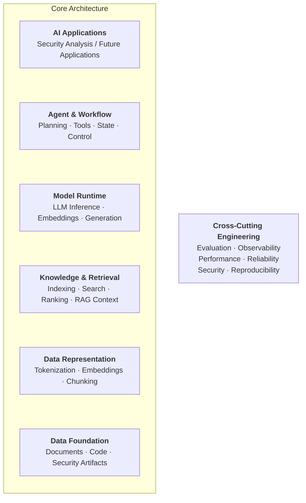
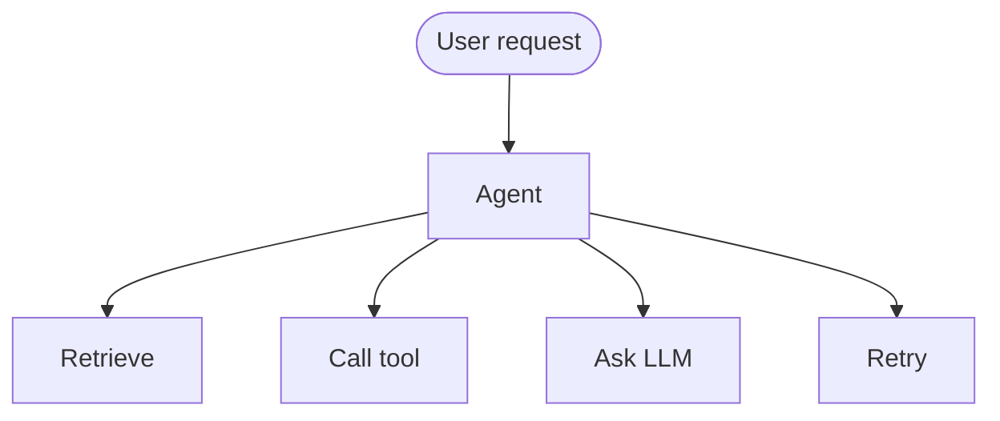

# Architecture

## Objective

This document describes the architectural vision, boundaries, and
design principles of Foundry.

Foundry is an AI systems laboratory built from first principles.
Its architecture evolves incrementally from low-level AI primitives
toward production-oriented AI systems.

This document intentionally describes architectural boundaries and
design principles rather than detailed implementation specifications.

Detailed designs for individual components are maintained separately
under `docs/design/`.

## System Layers
Foundry is intentionally layered. Each phase builds upon capabilities established by previous phases, while avoiding unnecessary coupling between components. The following diagram illustrate the layers of Foundry.

### Data Foundation
**Purpose:** Provide the raw information that AI systems operate on.

Examples:

* Text
* Documents
* Source code
* APKs
* Security reports
* Datasets

### Data Representation
**Purpose:** Transform raw data into representations suitable for machine-learning systems.

Components include:

* Tokenization
* Chunking
* Embeddings
* Feature representations

### Knowledge & Retrieval
**Purpose:** Turn representations into **usable knowledge access**.

While representation tells us **how information is encoded**, retrieval tells us **how information is found**.

### Model Runtime
**Purpose:** Provide a runtime environment surrounding the LLM which encompasses:

* LLM inference
* Embedding generation
* Streaming
* Batching
* Model selection
* Context management
* Generation
* *(Potentially local inference later)*

### Agent & Workflow
**Purpose:** Construct a deterministic workflow in a model runtime environment.

### AI Applications
**Purpose:** Provide the user-facing features by consuming lower layer capabilities (i.e. *not re-implementing them*).
